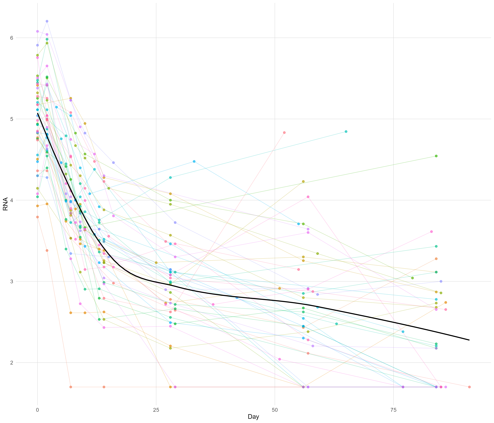
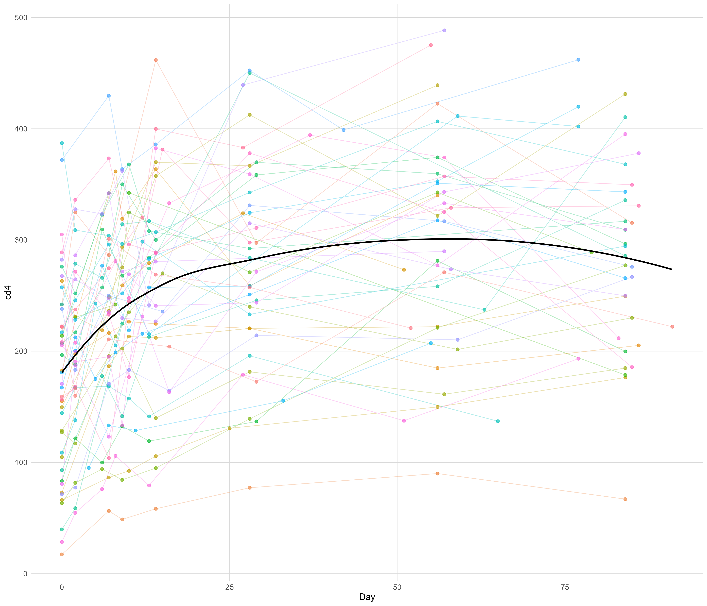

# Longitudinal-HIV-Analysis

## Overview

This project investigates the relationship between HIV-1 RNA and CD4 T-cell counts following an antiviral regimen using longitudinal analysis. 
Using data from the ACTG Protocol 315, linear and nonlinear models were compared to evaluate patient-specific trajectories and overall population trends. 
Model performance was assessed using diagnostic plots and Akaike Information Criterion (AIC), with nonlinear mixed-effects models providing the strongest fit to the data.

## Objectives

- Examine changes in HIV-1 RNA and CD4 counts over time
- Compare linear and nonlinear mixed-effects models
- Evaluate patient-specific variability using random effects
- Assess model performance using diagnostic plots and AIC
- Identify the model that best captures HIV progression dynamics

## Data

The analysis uses repeated measurements of HIV-1 RNA and CD4 T-cell counts from ACTG Protocol 315. After applying the study-period and completeness criteria, the analytical dataset contained 329 observations from 46 patients collected during the first 91 days following treatment initiation.

## Methods

### Statistical Approaches

Four candidate mixed-effects models were evaluated:

- Linear mixed-effects model with a random intercept
- Linear mixed-effects model with random coefficients
- Nonlinear mixed-effects model with a random intercept
- Nonlinear mixed-effects model with random coefficients

The analysis included:

- Exploratory data analysis and visualization
- Fixed- and random-effects estimation
- Subject-specific best linear unbiased predictions (BLUPs)
- Variance–covariance assessment
- Residual-versus-fitted and Q–Q diagnostic plots
- Model comparison using AIC

### Tools

- R
- nlme
- lme4
- tidyverse
- ggplot2
- corrplot

## Results

Among the candidate models evaluated, the nonlinear mixed-effects model with random coefficients produced the lowest AIC. Its diagnostic plots also indicated a better fit than the other candidate models.

The analysis suggested that:

- HIV-1 RNA levels generally decreased following treatment initiation.
- CD4 T-cell counts generally increased during the early treatment period.
- Patient trajectories varied around the overall population trends.
- Allowing model parameters to vary by patient improved fit within the set of models evaluated.

These findings are specific to this dataset, analytical period, and set of candidate models.

## Repository Contents

- figures/: Exploratory and model-diagnostic figures
- scripts/: R code for data preparation, visualization, modeling, and diagnostics
- report/: Full project report

## Skills Demonstrated

- Longitudinal biological data analysis
- Linear and nonlinear mixed-effects modeling
- Random-intercept and random-coefficient models
- Model diagnostics and comparison
- Data cleaning and visualization in R
- Interpretation and documentation of statistical results
