This folder contains exploratory visuals, diagnostic plots, and model comparison figures generated for analysis.

## Longitudinal HIV-1 RNA Trajectories

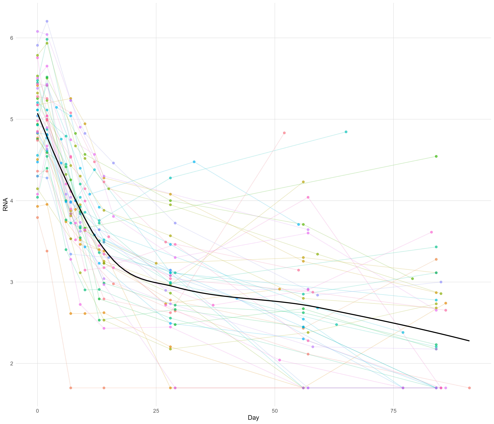
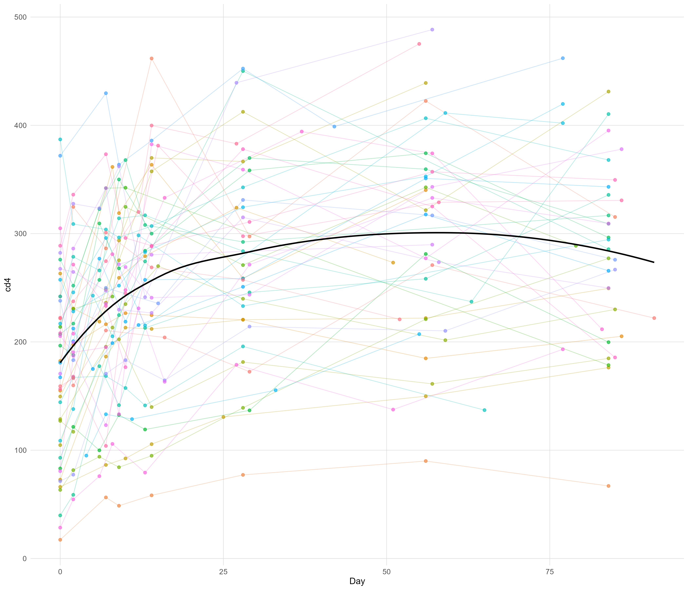

## Violin Plots

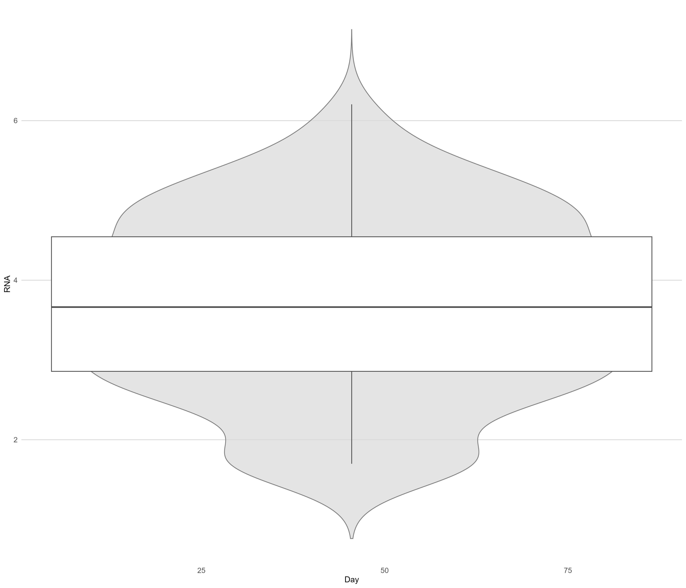
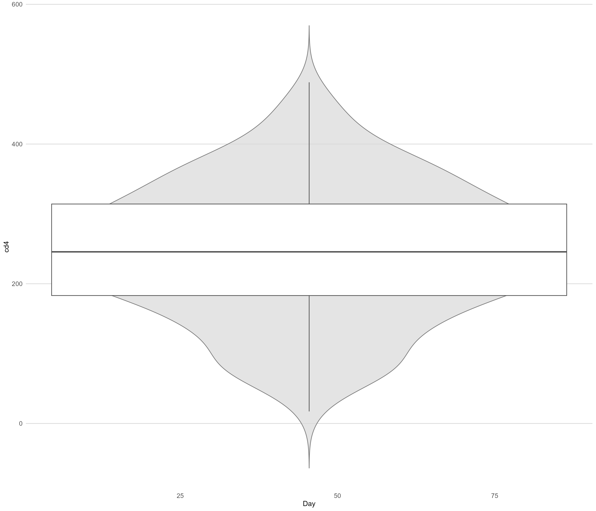

## Correlation Analysis

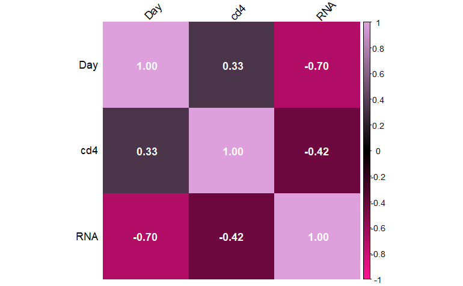

## Model Diagnostics

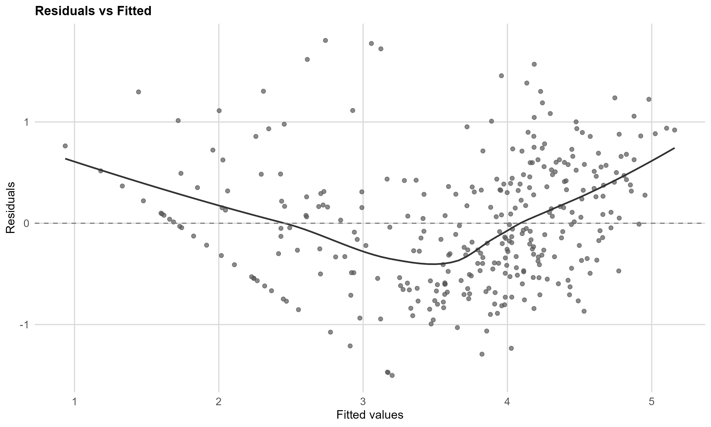
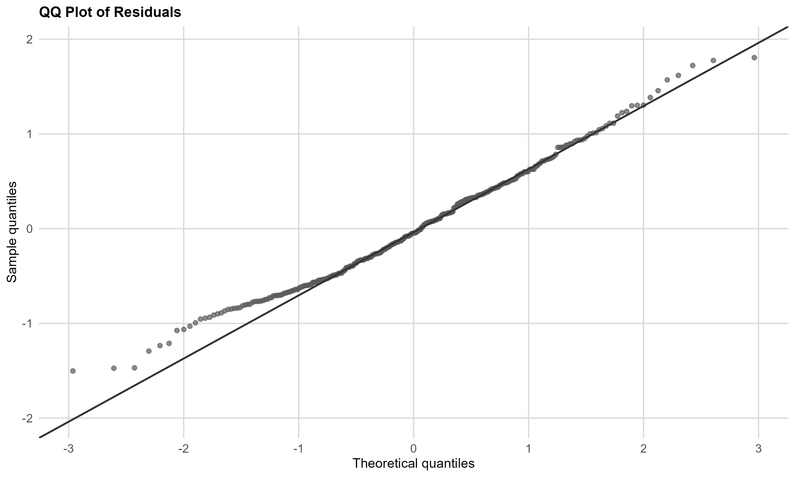
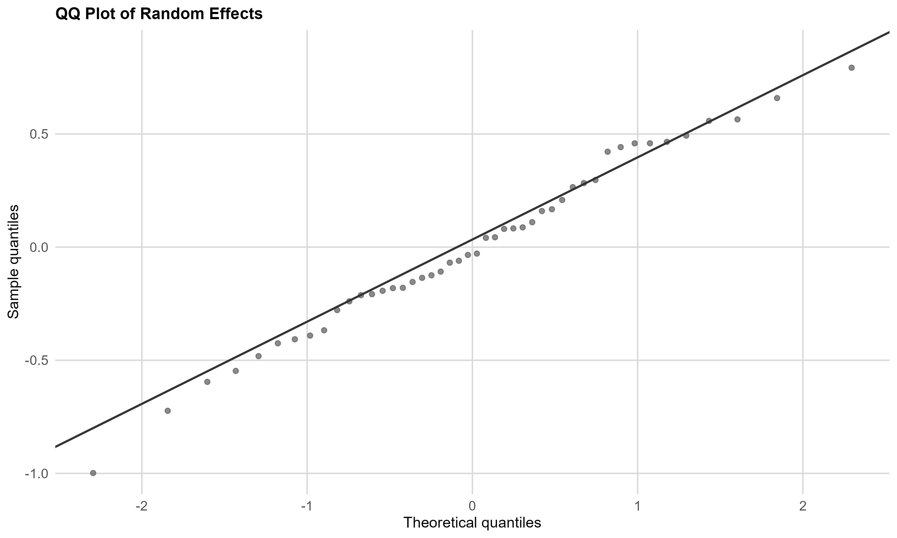

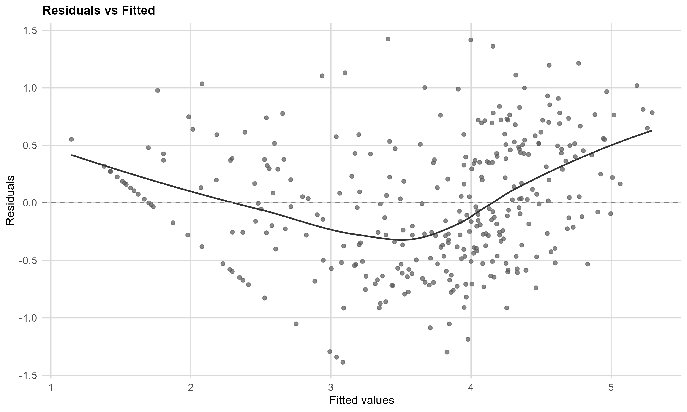

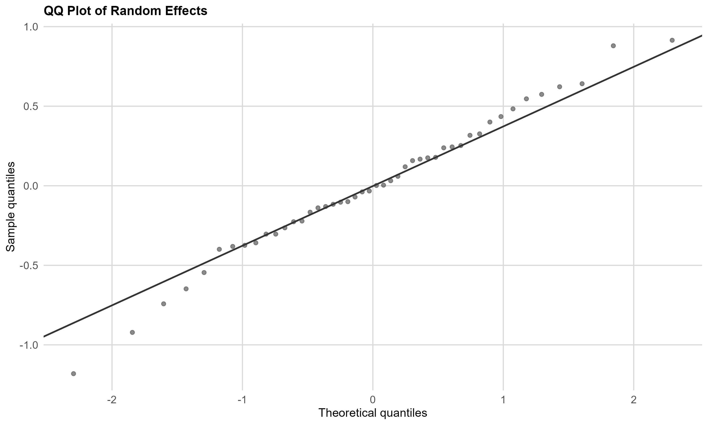

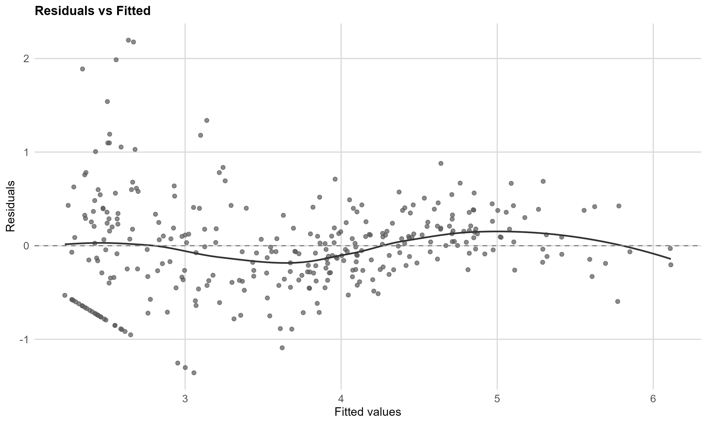

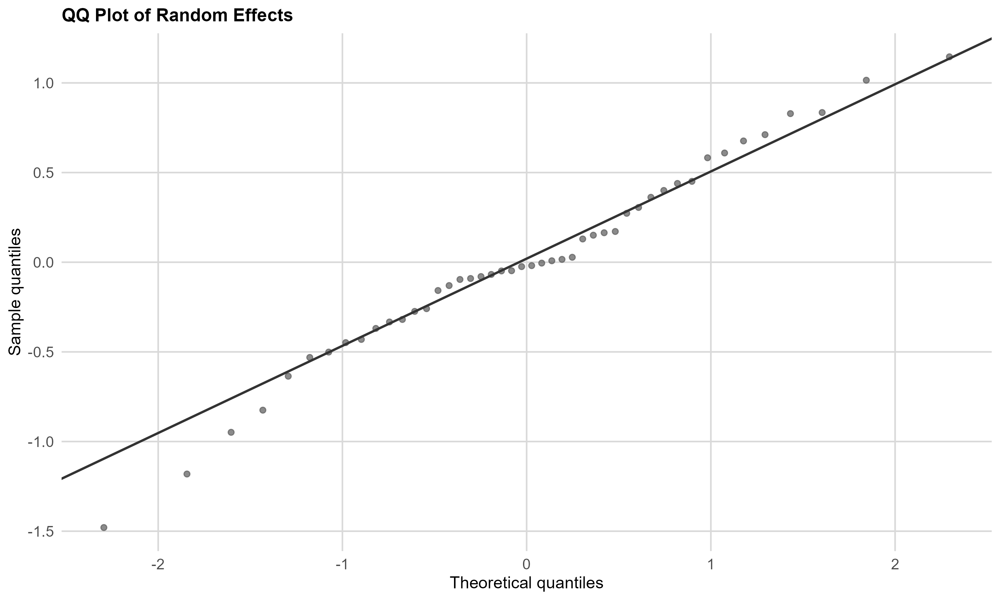

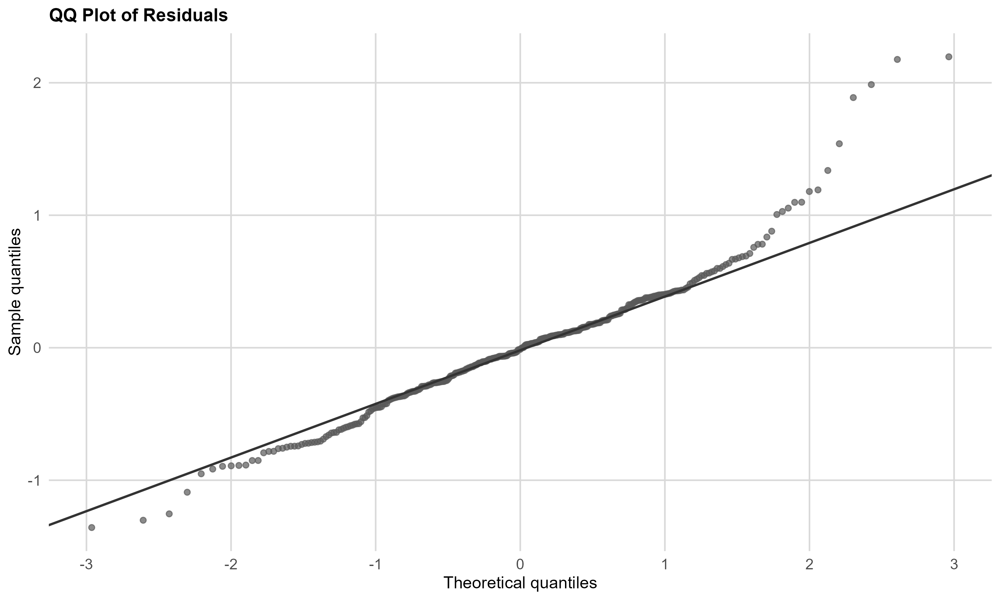

